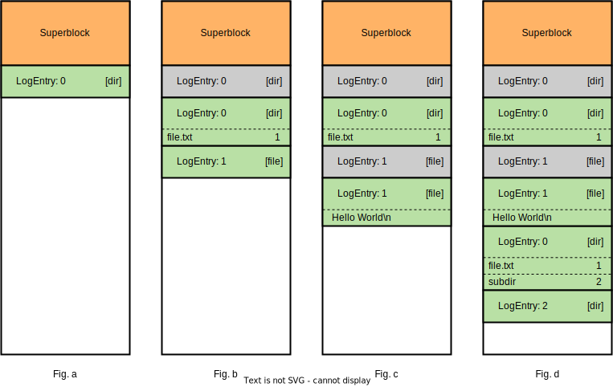

# Administrivia

[- NEW INSTRUCTIONS: -]
A `prebuilt_disk` has been added which contains a working log file system with several files and subdirectories. You should be able to mount and read the files and directories from it.
[- END NEW INSTRUCTIONS -]

- **Due date**: December 8th, 2023 at 11:59pm.
- **Handing it in**: 
  - Copy all your files to `~cs537-1/handin/<cslogin>/P7/`. Your `P7` folder should look like 
    ```
    P7/
    ├── mkfs.wfs.c
    ├── mount.wfs.c
    ├── fsck.wfs.c (optional)
    ├── wfs.h
    └── ... (other header files, README, ... No need to submit Makefile)
    ```
    If you are working with a partner, only one student must copy the files to their handin directory.
- Late submissions
  - Projects may be turned in up to 3 days late but you will receive a penalty of 10 percentage points for every day it is turned in late.
  - Slip days: 
    - In case you need extra time on projects,  you each will have 2 slip days for individual projects and 2 slip days for group projects (4 total slip days for the semester). After the due date we will make a copy of the handin directory for on time grading.
    - To use a slip day you will submit your files with an additional file `slipdays.txt` in your regular project handin directory. This file should include one thing only and that is a single number, which is the number of slip days you want to use (ie. 1 or 2). Each consecutive day we will make a copy of any directories which contain one of these slipdays.txt files.
    - After using up your slip days you can get up to 90% if turned in 1 day late, 80% for 2 days late, and 70% for 3 days late. After 3 days we won't accept submissions.
    - Any exception will need to be requested from the instructors.
    - Example slipdays.txt
      ```
      1
      ```    
- Some tests will be provided at ~cs537-1/tests/P7. The tests will be partially complete and you are encouraged to create more tests.
- Questions: We will be using Piazza for all questions.
- Collaboration: The assignment can be done alone or in pairs. Copying code (from others) is considered cheating. [Read this](https://pages.cs.wisc.edu/~remzi/Classes/537/Spring2018/dontcheat.html) for more info on what is OK and what is not. Please help us all have a good semester by not doing this.
- This project is to be done on the [Linux lab machines](https://csl.cs.wisc.edu/docs/csl/2012-08-16-instructional-facilities/), so you can learn more about programming in C on a typical UNIX-based platform (Linux).  Your solution will be tested on these machines.

# Introduction

In this project, you'll create a straightforward single-threaded log-structured filesystem using FUSE (Filesystem in Userspace). FUSE lets regular users build their own file systems without needing special permissions, opening up new possibilities for designing and using file systems. Your filesystem will handle basic tasks like reading, writing, making directories, deleting files, and more.

# Objectives

- To understand FUSE
- To understand and implement a log-structured filesystem

# Background

## FUSE

FUSE (Filesystem in Userspace) is a powerful framework that enables the creation of custom filesystems in user space rather than requiring modifications to the kernel. This approach simplifies filesystem development and allows developers to create filesystems with standard programming languages like C, C++, Python, and others.

To use FUSE in a C-based filesystem, you typically define callback functions for various filesystem operations such as getattr, read, write, mkdir, and more. These functions are registered as handlers for specific filesystem actions and are invoked by the FUSE library when these actions occur.

Here's an example demonstrating how to register a getattr function in a basic FUSE-based filesystem:

```c
#define FUSE_USE_VERSION 30
#include <fuse.h>
#include <stdio.h>
#include <string.h>
#include <errno.h>

static int my_getattr(const char *path, struct stat *stbuf) {
    // Implementation of getattr function to retrieve file attributes
    // Fill stbuf structure with the attributes of the file/directory indicated by path
    // ...

    return 0; // Return 0 on success
}

static struct fuse_operations my_operations = {
    .getattr = my_getattr,
    // Add other functions (read, write, mkdir, etc.) here as needed
};

int main(int argc, char *argv[]) {
    // Initialize FUSE with specified operations
    // Filter argc and argv here and then pass it to fuse_main
    return fuse_main(argc, argv, &my_operations, NULL);
}
```

This code demonstrates a basic usage of FUSE in C. The `my_getattr` function is an example of a callback function used to retrieve file attributes like permissions, size, and type. Other functions (like read, write, mkdir, etc.) can be similarly defined and added to my_operations. 

The `fuse_main` function initializes FUSE, passing the specified operations (in this case, my_operations) to handle various filesystem operations. This code structure allows you to define and register functions tailored to your filesystem's needs, enabling you to create custom filesystem behaviors using FUSE in C.

Remember to handle any program-specific arguments separately from those intended for FUSE. Filter out or process your program's arguments before passing them to `fuse_main` to prevent unintended issues or errors in the FUSE filesystem. 

## Mounting

The mount_point is a directory in the file system where the FUSE-based file system will be attached or "mounted." Once mounted, this directory serves as the entry point to access and interact with the FUSE file system. Any file or data within this mount point is associated with the FUSE file system, allowing users to read, write, and perform file operations as if they were interacting with a traditional disk.

A file can represent a container or virtual representation of a disk image. This file, when mounted to the mount_point for the FUSE file system, effectively acts as a disk image, presenting a virtual disk within the file system.

When the FUSE file system is mounted on a file (such as an image file), it's as if the contents of that file become accessible as a disk or filesystem.

## Log-Structured Filesystem

A log-structured filesystem stores data differently than traditional ones. In a log-structured filesystem, whenever data changes, instead of altering existing information directly, all modifications are added as new entries in a continuous log. This means that rather than modifying old data in place, each change is appended to the end of the log. This method keeps data organized and makes writing faster by avoiding scattered updates throughout the storage. 



Fig. a shows the layout of an empty disk. It consists of a superblock (stores the metadata of the filesystem) and a log entry (with inode number 0) for the root directory. 

If we create a file `/file.txt`, the new layout is illustrated in Fig. b. There are 2 changes to the disk image: 

1. We need to update the root directory to contain the file name `file.txt`. Since this is a log-structured filesystem, instead of modifying original log entry 0, we append an updated log entry 0 containing the new file name (colored green) with its log entry index. The original log entry 0 is now obsolete and shouldn't be used (colored gray). 

2. We need to append a log entry for the new file (log entry 1). The file is empty for now. 

Fig. c shows what happens after writing `Hello World\n` to `file.txt`. The previous log entry 1 is invalidated and a new log entry 1 with file content is appended. To find the log entry for `/file.txt`, start by retrieving the log entry 0 (root). Then, scan through the entries to pinpoint the inode number corresponding to `file.txt`. Finally, utilize this inode number to discover the most recent log entry associated with `/file.txt`. 

Fig. d shows the disk layout after a directory `/subdir` is created. Note that the log entry for the root directory (log entry 0) is again updated. 

Your implementation should use the structures provided in `wfs.h`. 

# Project details

You'll need to create the following C files for this project: 

- `mkfs.wfs.c`\
  This C program initializes a file to an empty filesystem. The program receives a path to the disk image file as an argument, i.e., 
  ```sh
  mkfs.wfs disk_path
  ```
  initializes the existing file `disk_path` to an empty filesystem (Fig. a). 
- `mount.wfs.c`\
  This program mounts the filesystem to a mount point, which are specifed by the arguments. The usage is 
  ```sh
  mount.wfs [FUSE options] disk_path mount_point
  ```
  You need to pass `[FUSE options]` along with the `mount_point` to `fuse_main` as `argv`. You may assume `-s` is always passed to `mount.wfs` as a FUSE option to disable multi-threading. 
- `fsck.wfs.c` (bonus)\
  This program compacts the log by removing redundancies. The disk_path is given as its argument, i.e., `fsck disk_path`. This functionality is exclusively for earning bonus points.

## Features

Your filesystem needs to implement the following features: 

- Create an empty file

- Create an empty directory
  
- Write to an existing file\
  The file isn't truncated, implying that it preserves the existing content as if the file is open in `r+` mode. Note that the `offset` for this operation may not be 0. 
- Read an existing file\
  Note that the `offset` for this operation may not be 0. 
- Read a directory
- Remove an existing file
- Get attributes of an existing file/directory\
  Fill the following fields of struct stat
  - st_uid
  - st_gid
  - st_atime
  - st_mtime
  - st_mode
  - st_nlink
  - st_size

Therefore, you need to fill the following fields of `struct fuse_operations`: 

```c
static struct fuse_operations ops = {
    .getattr	= wfs_getattr,
    .mknod      = wfs_mknod,
    .mkdir      = wfs_mkdir,
    .read	    = wfs_read,
    .write      = wfs_write,
    .readdir	= wfs_readdir,
    .unlink    	= wfs_unlink,
};
```

See [https://www.cs.hmc.edu/~geoff/classes/hmc.cs135.201001/homework/fuse/fuse_doc.html]() to learn more about each registered function. 

To simplify the project, your log-structured system doesn't wrap, which means it does not overwrite old data even when the disk is full. The filesystem is only compacted if `fsck.wfs` is executed. 

## Structures

In `wfs.h`, we provide the structures used in this filesystem. 

`wfs_log_entry` holds a log entry. `inode` contains necessary meta data for this entry. 

If a log entry represents a directory, `data` (a [flexible array member](https://gcc.gnu.org/onlinedocs/gcc/extensions-to-the-c-language-family/arrays-of-length-zero.html)) includes an array of `wfs_dentry`. Each `wfs_dentry` represents a file/directory within this folder. If the log entry is for a file, `data` contains the content of this file. 

Format of the superblock is defined by `wfs_sb`. We use the magic number `0xdeadbeef` as a special mark, and head shows where the next empty space starts on the disk. 

## Utilities

To help you run your filesystem, we provided several scripts: 

- `create_disk.sh` creates a file named `disk` with size 1M whose content is zeroed. You can use this file as your disk image. 
- `umount.sh` unmounts a mount point whose path is specified in the first argument. 
- `Makefile` is a template makefile used to compile your code. It will also be used for grading. Please make sure your code can be compiled using the commands in this makefile. 

A typical way to compile and launch your filesystem is: 

```sh
$ make
$ ./create_disk.sh         # creates file `disk`
$ ./mkfs.wfs disk          # initialize `disk`
$ mkdir mnt
$ ./mount.wfs -f -s disk mnt # mount. -f runs FUSE in foreground
```

You should be able to interact with your filesystem once you mount it: 

```sh
$ stat mnt
$ mkdir mnt/a
$ stat mnt/a
$ mkdir mnt/a/b
$ ls mnt
$ echo asdf > mnt/x
$ cat mnt/x
```

## Error handling

If any of the following issues occur during the execution of a registered function, it's essential to return the respective error code. These error code macros are accessible by including header `<errno.h>`.

- File/directory does not exist while trying to read/write a file/directory\
  return `-ENOENT`
- A file or directory with the same name already exists while trying to create a file/directory\
  return `-EEXIST`
- There is insufficient disk space while trying to append a log entry\
  return `-ENOSPC`

## Debugging

### Inspect superblock
```sh
$ ./create_disk.sh
$ xxd -e -g 4 disk | less
$ ./mkfs.wfs disk
$ xxd -e -g 4 disk | less
```
Using the above command, you can see the exact contents present in the disk image, before mounting.

### Inspect log-entries
```sh
$ ...
$ mkdir mnt
$ ./mount.wfs -f -s disk mnt
$ mkdir mnt/a
$ ./umount.wfs mnt
$ xxd -e -g 4 disk | less
```
Again for inspecting contents of the disk image, after mounting has taken place.

## Important Notes

1. Manually inspecting your filesystem (see Debugging section above), before running the tests, is highly encouraged.
2. A directory name and file name can't be the same.
3. A valid file/directory name consists of letters (both uppercase and lowercase), numbers, and underscores (_). 
4. Set maximum allowable file name length to 32
5. The maximum path length is 128
6. Please make sure your code can be compiled using the commands in provided makefile. 

# Further Reading and References

* https://www.cs.hmc.edu/~geoff/classes/hmc.cs135.201001/homework/fuse/fuse_doc.html
* [http://libfuse.github.io/doxygen/index.html]()
* `https://www.cs.nmsu.edu/~pfeiffer/fuse-tutorial/html/index.html`
* `https://www.cs.hmc.edu/~geoff/classes/hmc.cs135.201001/homework/fuse/fuse_doc.html`
* `https://github.com/fuse4x/fuse/tree/master/example`
* `/usr/include/asm-generic/errno-base.h`
* `xxd -e -g 4 disk`

